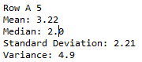

# Utilizing Machine Learning and Visualization Tools to Analyze Breast Tumor Measurements :hand: fa18-523-80

Evan Beall
Indiana University
Bloomington, IN 46408, USA 
ebbeall@iu.edu 

:o: format not followed

| github: [:cloud:](https://github.com/cloudmesh-community/fa18-523-80/blob/master/project-report/report.md)


## Abstract

Cancer is a life altering disease that affects people all over the world.  In the United States alone it is estimated that throughtout a person's lifetime they have around a 39.66% chance of developing cancer and a 22.03% chance of dying from cancer at all invasive sites [@fa18-523-80-www-acs].  Cancer research is a trillion dollar industry and gains more funding and researchers each year.  One of the most highly funded and visible forms of cancer is breast cancer.  Breast cancer research has taken the spotlight by being propped up by organizations cuch as the Suzan G Komen Foundation, National Breast Cancer foundation, etc.  The amount of private investors, charitable donations, and phamaceutical companies that have been funding research to treat this disease has been astonomical for decades.

Due to the fact that breast cancer research takes such a spotlight in the cancer research world, we decided to take a look at possible ways that cloud computing and machine learning could help physicians with diagnosing breast cancer patients.  We have implemented a MongoDB Atlas database and combined it with several packages within the powerful Python 3.6 environment to perform analysis on a breast cancer fine needle aspirate dataset.  This dataset was developed at the University of Wisconsin.  It involved patients who had fine needle aspirate biopsies performed on suspicious tumors found in breast tissue.  The resulting dataset contains characteristics of these tumors.  We have stored this dataset in the cloud via MongoDB Atlas and then taken this data and run a k-means clustering algorithm on it via the Python environment.

We have explored a method that is easily understandable and potentially deployable for other cancer diagnosis.  Utilizing cloud technology to host the database like MongoDB Atlas would allow researchers to collaborate accross the globe to give the k-means algorithm that we have created more training data and potentially make the algorithm more accurate for breast cancer diagnosis.  This structure of database hosting and python algorithm could also potentially be applied to other types of breast cancer and collaboration around the world could allow for training datasets to be shared and compared.

## Keywords

Breast Cancer, Python, big data, random forest

## Introduction

Cancer is one of the most devestating conditions financially, emotionally, and physically to the person who is diagnosed and those around them.  This disease can be classified as a human problem that no one can escape from.  With the odds of developing this disease over one's lifetime being over one in three, it is likely that you will be impacted by this disease at some point in life.  In the United States alone "the Agency for Healthcare research and Quality estimates that the direct medical costs (total of all health care costs) for cancer in the US in 2015 were $80.2 billion."  This figure includes all heath care costs that are associated with cancer.  There are several aspects that go into the total cost of health care for cancer patients, but one of the main oness is the cost of cancer treatment.

Breast cancer has high visability in the public eye and has some of the highest funding of any other types of cancer out there.  In the United States, there is branch known as the National Cancer Institute that helps to organize governmentally funded research into Cancer.  The current budget that has been allocated to the NCI for the 2019 fiscal year is $5.74 billion [@fa18-523-80-222-nci].  This budget represents an increase of 79 million dollars from 2018. Several large pharmaceutical companies and researchers get large grants to research new compounds and molecules to fight of these diseases. The oncology pharmaceutical industry is over a trillion dollar industry and each year their are thousands of clinical trials that are ongoing.

Oncology clinical trials function by exposing patient populations to new types of therapies and recording the results.  In the past, cancer treatment and research has been mainly focused on casting a wide net to attempting to treat all individuals with generalized treatment regiments.  The focus of large pharmaceutical companies has been to research drugs that can be used in a one drug fits all methodology.  However, in recent years this mindset has begun to change.  Many of the large pharmaceutical companies are moving to a more tailored approach in combating cancer.  This has been seen in the form of genomic testing, targetted therapy, and specific receptor based therapies.  Clinical trials are setup to collect data throughout the time that the patient is on trial.  Some clinical trials are set up to run for decades at a time with hundreds of visits per patient.  These trials can includes tens of thousands of patients.  All of this together means that there is an enormous amount of data collected during each of these trials.  This data is stored in electronic data capture systems or EDCs.  The amount of data that needs to be worked on an analyzed for each of these trials means that there is a need for better ways to accomplish this task.  Utilizing data science techniques such as cloud computing and machine learning seems like a natural fit into the world of oncology research.

We will delve into the possible implementation of machine learning techniques to analyze one aspect of an Oncology clinical trial.  The Wisconsin Breast Cancer dataset that is utilized in this analysis give characteristics of tumor tissue.  The dataset assigns a value to these characteristics.  The dataset also provides the tumor diagnosis of benign of malignant.  This will allow us to use this dataset as a training dataset to teach the machine learning algorithm we design  The goal will be to create a database to store this data within MongoDB Atlas and utilize Python to create an algorithm that can predict malignant vs benign tumors.  To determine how accurate the algorithm can predict tumor diagnosis in breast cancer patients we will compare our k-means algorithm results with those povided within the dataset.  This report will also run further analysis of other tumor characteristics that are present in the dataset.  If an angorithm like this can be proven to be accurate enough, its implementation in clinical trial research and oncology treatment in general could be life saving.  It could also help to eliminate the human error that is seen when a physician alone is making a diagnosis.  By utilizing this tools as an aid to help physicians determine breast cancer diagnosis it could allow for earlier detection and more accurate results.

### Dataset

The dataset used in this analysis is the Breast Cancer Wisconsin Data set.  This dataset was created by Dr. William H. Wolberg.  Dr. Wolberg is a physician at the University of Wisconsin Hospital.  The dataset utilized for this analysis is a collection of fine needle aspirate breast cancer tumor samples.  Fine needle aspirate biopsies are biopsies that are taken by inserting a fine needle into the affected site.  The extracted tissue is then suspended into an aqueous solution and mounted on a slide.  Dr. Wolberg then used a graphic program called Xcyt to analyze the features of each of these biopsies.

This dataset includes 569 unique patients with 12 attributes per patient. The attributes provided by this dataset includes de-identified patient identifiers, pathological diagnosis, and tumor characteristics.  The specific characteristics included are clump thickness, uniformity of cell size, uniformity of cell shape, marginal adhesion, single epithelial cell size, bare nuclei, bland chromatin, normal nucleoli, mitosis, and class.  Each of these characteristics are assigned a numerical value from 1 to 10 except for the "Class" characteristic.  The Class characteristics contain the results for malignant vs benign, these are assigned values 2 or 4 respectively.  The characterisitcs that are included in the data are of the cell nuclei that was present in the digitized images.  The dataset is publicly available for analysis.  The following image contains at what time points that the data points were collected by Dr. Wolberg for this dataset in +@fig:datapoints.

![Datapoints [@fa18-523-80-Borges]](images/Dataset_Instances.PNG){#fig:datapoints}

### Xcyt

Xcyt is a program that has three parts.  The initial portion of the program involves an operator selecting nuclei from FNA biopsy specimen by drawing rough lines around each nuclei in question.  The program then applies a curve fitting program to determine the exact boundaries of each cell nuclei that was identified by the operator  This program then computes ten unique characteristics from the specimen nuclei.  For each of these the mena, extreme value, and standard derror are output.  As a result, each patient that is analyzed by Xcyt has a 30-dimensional vector created.  The data analyzed by his team included both this 30-dimensional vector and another dataset that included the overall nuclei characteristics. The second portion of this dataset is the data that is included within the Breast Cancer Wisconsin Data set that will be utilized for this analysis.  The following image shows an example of what an image going into the Xcyt program would look like +@fig:xcytinput:

![Xcyt Input[@fa18-523-80-Borges]](images/Xcyt_Input.PNG){#fig:xcytinput}

The next part of the Xcyt program is the diagnosis portion.  Xcyt utilizes a linear programming-based diagnostic method to determine if the suspected malignancy contains benign or malignant cells based off of the characteristic generated by the initial model.  The system used by Xcyte is a variant of the multisurface method called the multisurface method-tree.  This diagnositc method creates strict planes based on malignant or non-malignant based on selected characteristics from the intial part.  In the initial analysis the most accurate output occurred when extreme area, extreme smoothness, and mean texture were plotted.  These resulted in nearly 97.5% accuracy in identifying malignant vs benign tumors.  

The final part of the Xcyt program involves predicition of recurrence of the tumor.  This portion utilizes a kernel density estimation to compare the amount of benign vs malignant nuclei that are found within a sample.  By comparing these two figure's densities a bayesian computation is applies to compare the height of malginant densities divided by the sum of the densities of malignant and benign nuclei.  

## Implementation

### Requirements

* Python 3.6 or higher
  * This instance was performed in the Spyder IDE
* Python Packages
  * Python Standard Library
  * Pandas
  * Numpy
  * Matplotlib
  * pymongo
* Dataset downloaded in .csv file format
* MongoDB Atlas Account

### MongoDB Atlas Database

The cloud-based database used in this project is the MongoDB database called MongoDB Atlas.  To deploy this type of database the user will need to create a cluster and then set up a database and collection within that cluster.  This will allow the user to start entering documents into the collection.  The type of cluster that was used in this project is the MongoDB Atlas free tier instance.  This instance uses the M0 Shared Cluster Tier via an AWS server.  This cluster tier is free to deploy and will remain free forever  This type of collection comes with 512 MB of free data storage.  The below image shows the type of MongoDB Atlas database that was constructed for this project +@fig:mongodbbreast.

![Mongodb Breast[@fa18-523-80-MongoDB]](images/MongoDB_Server.PNG){#fig:mongodbbreast}

This project has set up a database that has the data to be analyzed already inside.  The following code will allow a user to access this database to run analysis:

```
import pymongo
import pandas as pd

connection = pymongo.MongoClient('mongodb+srv://I523Admin:<I523Admin>@i523breastcancer-fdclg.mongodb.net/test?retryWrites=true')

db = connection.Wisconsin_Breast_Cancer.I523

df = pd.DataFrame(list(db.find()))
```

While Dr. Wolberg and his team used the novel program of Xyct to perform their machine learning algorithm on a more complex dataset, this report will instead use the popular k-mean clustering algorithm on a more high level dataset within the Spyder Python 3.6 environment.  Once this environment has been donloaded and the datset has been download in .csv format.  The next step would be to import the pandas, numpy, and matplotlib packages will need to be imported into the code.  This will be accomplished using the following code:

```
import matplotlib.pyplot as plt
import pandas as pd
import numpy as np
from pandas import DataFrame, read_csv
from matplotlib.backends.backend_pdf import PdfPages
import pymongo
```

The dataset that is in the working directory can now read using the pandas.read_csv() and placed in a dataframe.  Alternatively, to grab the data from the MongoDB Atlas database you would run the code included above.  Both of these methods will get you the data that is needed for this analysis.  However, the MongoDB Atlas method is deployable by all others By utilizing this simplistic method it allows this program to be easily reproduceable and deployable by researchers that are not well versed in machine learning methodology.  This would also allow for researchers to shape the analysis to their own data and create customizations to the base program.  The 16 missing values in the dataset are also addressed by utilizing the fillna() method assigning the value A7 for all missing values via the following code:

```
df = pd.read_csv('breastcancer.csv', na_values = '?')
    df = df.fillna(df['A7'].median())
```      

This analysis will be split into several different parts.  The first part will include a statistical output for each of the characteristics that have been derived by the dataset.  The frequency of each of these characterisitcs will then be plotted on basic bar graphs.  Further visualization is also derived to include characteristics that might be relevant to researchers.  Some of the derived statistical features will include mean, median, and standard deviation of each of the characteristics.  The following is a sample of code that shows how the visualizations were created:

```
    with PdfPages('finalproject.pdf') as pp:
        for i in range (9):
            fig1 = plt.figure()
            sp1 = fig1.add_subplot(1, 1, 1)
            sp1.set_title(columns[counter])
            sp1.set_xlabel("Results")
            sp1.set_ylabel("Number of Cases")
            plt.xticks((1,2,3,4,5,6,7,8,9,10))
            sp1.hist(df[(column_header[counter])], bins=10, color="blue", edgecolor = "black", alpha=0.5, label =         [1,2,3,4,5,6,7,8,9,10])
            pp.savefig(fig1)
            counter = counter + 1
    pp.close()
```
In the second part of the analysis, a basic k means algorithm will be created and implemented on the data set.  The code will select two data points randomly using the np.random() method as the initial 'means' of the dataset these can also be seen as the initial cluster points.  These clusters will be utilized for each datapoint to calculate the euclidian distance.  This dataset will continue to interate in this way by selecting randomly selected datapoints as new cluster points each time.  Each time the final cluster assignment will be compared to the one before this.  The condition for the system to stop this iteration will occurr when the system identifies no change in cluster assignment or the system has iterated 1500 times.  This is put in place to keep the cluster method from running continuously.

The final portion of this will compare how successful the k means algorithm we have implemented predicted the diagnosis condition.  In this step we take the cluster asssignment and compare it to the final column included in this dataset that contains the actual diagnosis of the patient.  By doing this we are able to calculate the error rate for each cluster and the overall error rate for both clusters.  This will give us a real world definition of how accurately the k mean algorithm is functioning.  

## Results

Applying the k-means algorithm to this data set happened in several different steps.  The following analysis will be split into those different steps to breakdown how the final results were achieved.

### Visualizaton

In the first section of the code the data is read from a .csv file using the pandas read_csv() method.  This data was then inserted into a dataframe.  Once here the mean, median, standard deviation, and variance were all calculated per characteristic.  An example of these results can be seen below +@fig:statistics:

{#fig:statistics}

Each characteristic in this dataset is assigned a value of 1-10.  Using these variable several visualizations were created to allow for the ressearch scientists and physicians to have an idea of how the cells in their research tumors look.  This can be utilized in future studies to account for variances in tumor malignancies accross cancer diagnosis.  An example of these visualizations can be seen below in +@fig:chromatin:

{#fig:chromatin}

### K-Means Clustering

The next part of this analysis included the creation and recalculation steps for the k-means clustering steps.  During this step cluster points were chosen as random data points within the dataset.  The eulicidan distance was then calculated from each of these clusters to determine a malignancy diagnosis.  Upon either reaching 1500 iterations or the cluster assignment not changeing across iterations the clustering would complete.  The system would then produce the calculated k means for each characterisitc in the study.  The following table shows the calculated k-means for each characteristic depending on their malignancy diagnosis.


### Clustering Assessment

The final portion of the study compares the results of the k-means clustering algorithm with that of the correct diagnosis that was provided in the initial dataset.  This portion of the study calculates the error rate for both the malignant and benign clusters.  This then goes on to calculate the total error rate accross both clusters.  The following table identifies the total amount of datapoints in each cluster and the error rates that were calculated.

### Benchmarks

In Dr. Wolbergs experiments they were utilizing a 30-dimensional vector for each data point in this data set.  The deployment used in this study only utilizes a 10-dimensional vector for each analysis.  In this experiment it takes around 9.65 seconds for the analysis to import the data, read the data, sort the data into initial clusters, iterate over the dataset to ensure cluster assignments are correct and then run a comparison between estimated cluster assignments and the real cluster assignment.  The only values that could be found from Dr. Wolberg's implementation of the Xcyt program were the length of time that the system would take to generate the characteristic map from the FNA imaging.  This was estimated to take around five to ten minutes.  This however is not a comparable time stamp as the system was estimating the characteristics and not running the diagnostic report.

## Limitations

Limitations of this type of analysis are based around several factors.  The first and biggest one is the necessity to utilize the initial portion of the Xcyt program to generate a characteristic map of FNA samples.  This program is currently accessable for free via Nick Street at University of Iowa.  These packages have been outdated for many years, however, Broad Institute has maintained the packages for implementation in R.  To utilize these datasets in the future some manipulations to port the datasets generated via R to python for machine learning would be required.  Without this information, the machine learning algorithm implemented in this report will not run.  The assumption is that the initial portion of the Xcyt program output could be utilized going forward and combined with the easy to implement and customize python algorithm that is displayed in the report above.

Another limitation of this type of algorithm is its ability to apply to a variation of cancer types.  FNA biopsies are not able to be produced on cancers that are not solid tissue samples.  This limits the effectiveness of this analysis as it only focuses on a type of biopsy only available to a selection of cancer tissues.  While this is a limitation, implementing this algorithm for other solid tumor cancers could be extremely helpful for diagnostic purposes.

## Conclusion

Dr. Wolberg team's implementation of the novel Xyct program to diagnose malignancies in breast cancer patients is a revolutionary way that machine learning could be implemented in cancer research.  This type of methodology was implemented on a very specific instance of cancer research.  The machine learning algorithm was able to identify tumor nuclei characteristics that indicated malignant tumor cells at a rate of 97.5%.  However, this type of machine learning program is extremely specific and not very reproduceable.  This program utilized an analysis method that created a 30-dimensional vector for each patient.  The team was then able to run analysis on each comparison point to find the highest rate of correct results.  Finding that very specific combinations of characteristics would lead to higher rates of success.  In the end they discovered that the specific combination of extreme area, extreme smoothness, and mean texture gave the highest success rate.  This is a time consuming way to run analysis as it took the algorithm nearly 5-10 minutes to create the 30-dimensional vector for each sample.  On top of this, the researchers would need to then use trial and error to discover which combination of these vectors would give the highest success rate.

By cutting this down to only the high level data assessment with fewer characteristics to analyze the process on the front and back end can be sped up significantly.  The Xcyt program implemented by Dr. Wolberg's team utilzed very specific characteristics that may or may not apply accross other cancer diagnosis.  However, by utilizing the higher level dataset with only 10 points of comparision we could make this method more scalable and applicable accross all oncological diagnosis.  The k-means clustering algorithm that was implemented in this report showed around a 96% rate of success.  This is only 1.5% lower then that seen by Dr. Wolberg's team.

By lowering the amount of complexity of assessment, we have increased the reproduceablity accross other cancer diagnosis and decreased the time investment for researchers to run analysis.  By weighing the fact that the decrease in efficacy is only 1.5% we could allow researchers to make a judgement call as to if this decrease in efficacy is worth the increase in efficiency.  This tool should not be used as the sole method for diagnosis, but should be used in combination with physician determination in combination with other diagnositic tools.  That being said, making this type of analysis more easily reproduced and available to all researchers would more then make up the 1.5% loss in efficiency.  Python tools are much more approachable and easier to deploy the the proprietary program Xcyt that was created by Dr. Wolberg's team.  Since Python is an open sourced tool and each package that was used in this analysis is also available to everyone.  This means this method is easily accessable to all researchers willing to take the time to set up analysis points for their teams.
